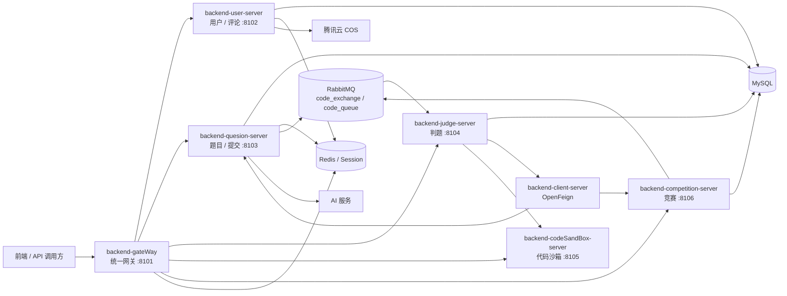
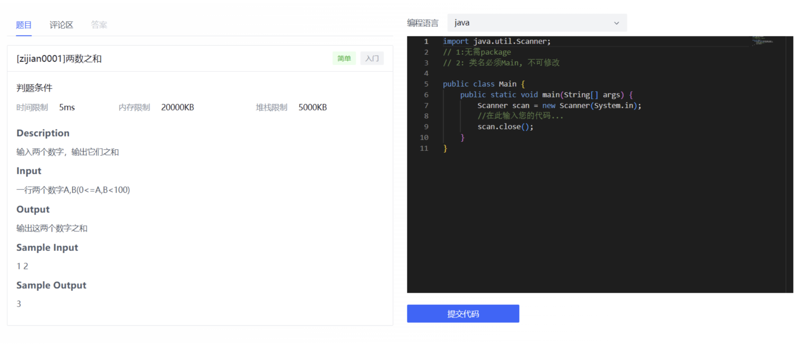
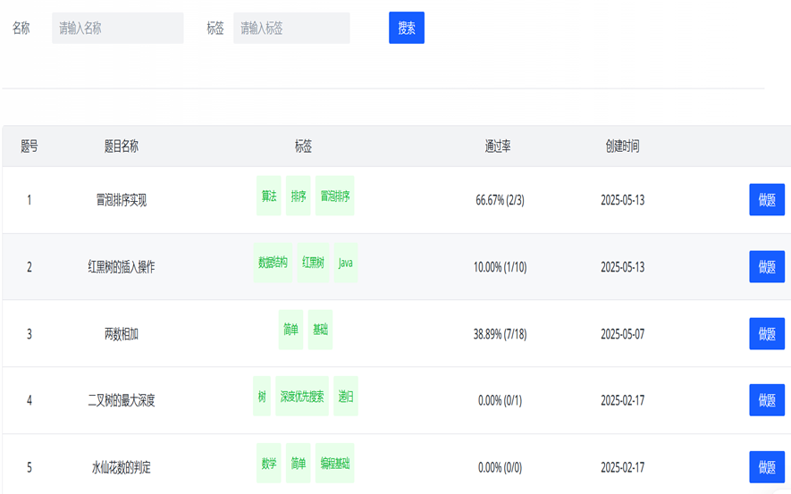
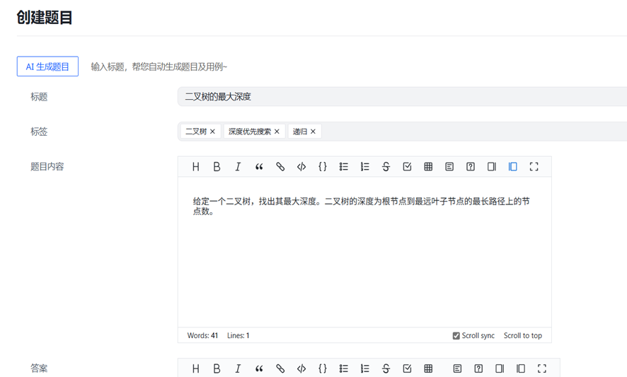
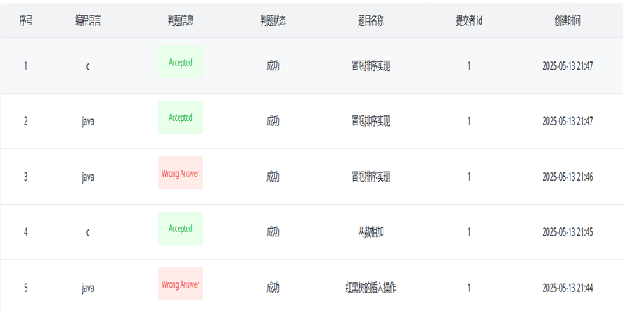
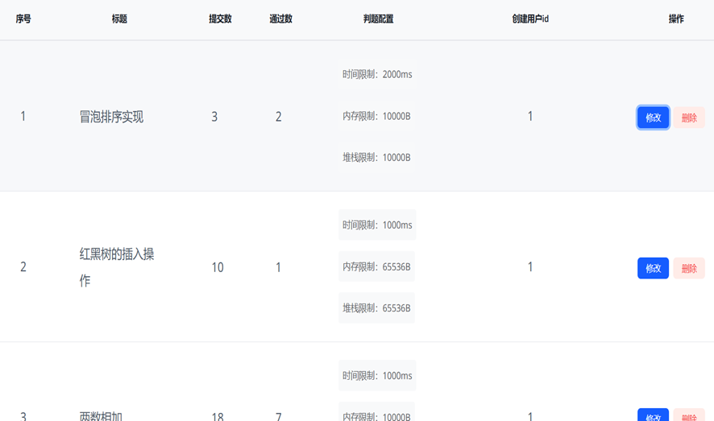
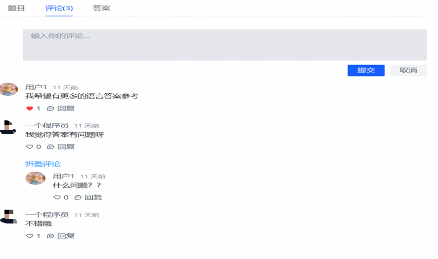
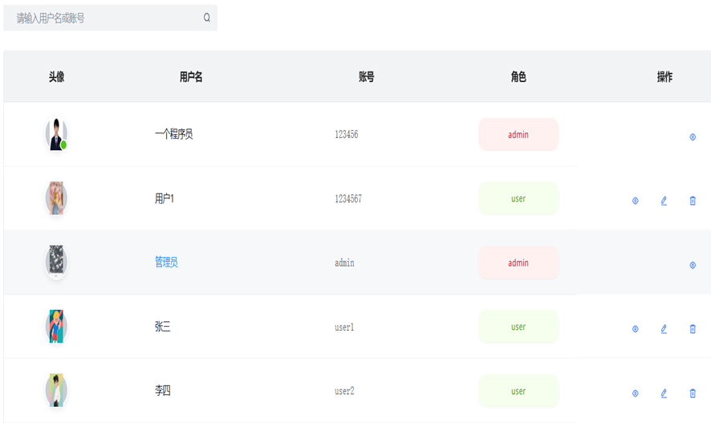
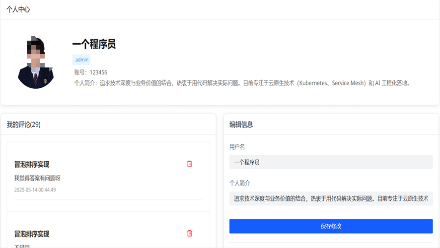
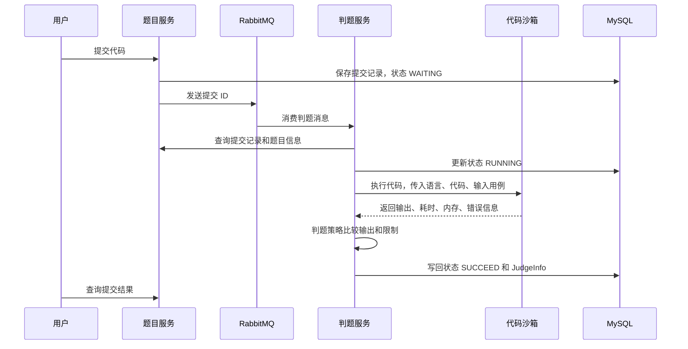

# YYOJ 在线判题系统

YYOJ 是一个基于 Spring Boot / Spring Cloud Alibaba 的在线判题系统后端项目，采用微服务拆分，覆盖用户管理、题库管理、代码提交、异步判题、代码沙箱、竞赛管理、评论互动、文件上传和 API 网关等核心能力。

项目适合作为在线编程平台、课程实验平台、算法训练系统或毕业设计后端基础工程。

## 项目亮点

- 微服务架构：按用户、题目、判题、代码沙箱、竞赛、网关等业务边界拆分服务。
- 异步判题：题目提交后通过 RabbitMQ 投递判题任务，判题服务消费任务并更新结果。
- 多语言执行：代码沙箱支持 Java、C、C++、Python 等语言的编译 / 运行流程。
- 策略化判题：根据语言与题目配置选择对应判题策略，统一处理时间、内存、输出等判题信息。
- 竞赛模块：支持竞赛发布、报名、竞赛题目、竞赛提交、排行榜 / 图表统计等流程。
- 网关聚合：通过 Spring Cloud Gateway 统一转发服务，并集成 Knife4j 聚合接口文档。
- 公共模型复用：通过 `backend-model` 和 `backend-common` 统一实体、DTO、VO、异常、工具类和配置。
- AI 辅助能力：项目中预留题目生成 / 内容辅助相关 AI Manager 能力。

## 技术栈

| 分类 | 技术 |
| --- | --- |
| 核心框架 | Spring Boot 2.6.13、Spring Cloud 2021.0.5、Spring Cloud Alibaba 2021.0.5.0 |
| 服务治理 | Nacos Discovery |
| 网关 | Spring Cloud Gateway |
| 数据库 | MySQL 8.x |
| ORM | MyBatis、MyBatis-Plus |
| 缓存 / 会话 | Redis、Spring Session Redis |
| 消息队列 | RabbitMQ |
| 接口文档 | Knife4j / Swagger |
| 远程调用 | OpenFeign |
| 工具库 | Hutool、Gson、Apache Commons、EasyExcel |
| 对象存储 | 腾讯云 COS |
| AI SDK | 智谱 AI OpenAPI SDK |
| 构建工具 | Maven，多模块工程 |

## 项目结构

```text
yyoj
├── backend-common                 # 公共响应、异常、配置、工具类、AI / COS 管理器
├── backend-model                  # Entity、DTO、VO、Enum、代码沙箱模型
├── backend-client-server          # OpenFeign 客户端，服务间调用接口
├── backend-gateWay                # API 网关、路由、鉴权过滤、Knife4j 聚合
├── backend-user-server            # 用户、评论、点赞、文件上传等能力
├── backend-quesion-server         # 题目管理、题目审核、普通题目提交
├── backend-judge-server           # 判题服务、RabbitMQ 消费、判题策略
├── backend-codeSandBox-server     # 代码沙箱服务，执行用户代码
├── backend-competition-server     # 竞赛、报名、竞赛题目、竞赛提交与统计
├── sql
│   └── yyoj.sql                   # 数据库建表与初始化数据
└── pom.xml                        # Maven 父工程
```

> 说明：目录名 `backend-quesion-server` 保留了当前仓库中的原始拼写。

## 架构图

GitHub 可以直接渲染下面的 Mermaid 图，也可以将最终产品截图放到 `docs/images/` 目录后替换本节内容。



## 项目截图

### 答题页面



### 题库列表



### 创建题目



### 提交记录



### 题目管理



### 竞赛日历


### 评论区


### 评论详情



### 用户管理



### 个人中心



## 核心功能

### 用户与权限

- 用户注册、登录、退出登录。
- 当前登录用户查询、按 ID 查询用户、批量查询用户。
- 用户信息编辑、管理员编辑用户、删除用户。
- 密码重置与强制重置。
- 基于角色的权限控制，公共模块中提供 `AuthCheck` 注解和用户角色枚举。
- 文件上传能力，配合腾讯云 COS 存储。

### 题目管理

- 创建、更新、删除、编辑题目。
- 按 ID 获取题目和题目 VO。
- 分页查询题目列表、我的题目、待审核题目。
- 题目审核流程。
- AI 生成 / 辅助生成题目接口。
- 支持题目判题用例、时间限制、内存限制等判题配置。

### 代码提交与判题

- 用户提交代码后生成提交记录。
- 题目服务将判题任务发送到 RabbitMQ。
- 判题服务消费消息，调用题目服务获取题目、提交记录和判题用例。
- 判题服务根据 `codesandbox.type` 选择代码沙箱实现。
- 代码沙箱编译并执行用户代码，返回输出、执行时间、内存和错误信息。
- 判题策略比较实际输出与期望输出，写回提交状态和 `JudgeInfo`。

### 代码沙箱

当前沙箱入口根据提交语言选择执行器：

- `java`：Java 原生执行沙箱。
- `cpp`：C++ 原生执行沙箱。
- `c`：C 原生执行沙箱。
- `python`：Python 原生执行沙箱。

沙箱接口包含基础鉴权请求头，默认头名为 `auth`，默认密钥为 `secretKey`。生产环境建议替换为更安全的内部鉴权方案，并将密钥放入环境变量或配置中心。

### 竞赛系统

- 发布竞赛。
- 加载竞赛列表。
- 用户报名竞赛。
- 查看创建的竞赛和参与的竞赛。
- 发布竞赛题目。
- 获取竞赛题目详情。
- 提交竞赛题目。
- 更新竞赛题目判题结果。
- 获取竞赛统计图表数据。

### 评论与互动

- 题目评论展示。
- 我的评论查询。
- 新增评论。
- 删除评论。
- 评论点赞 / 取消点赞。
- 支持父子评论关系。

## 服务端口

| 服务 | 模块 | 默认端口 | Context Path / 路由 |
| --- | --- | ---: | --- |
| 网关服务 | `backend-gateWay` | 8101 | `/api/**` |
| 用户服务 | `backend-user-server` | 8102 | `/api/user` |
| 题目服务 | `backend-quesion-server` | 8103 | `/api/question` |
| 判题服务 | `backend-judge-server` | 8104 | `/api/judge` |
| 代码沙箱服务 | `backend-codeSandBox-server` | 8105 | `/api/sandbox` |
| 竞赛服务 | `backend-competition-server` | 8106 | `/api/competition` |

网关已配置以下路由：

- `/api/user/**` -> `backend-user-server`
- `/api/question/**` -> `backend-question-server`
- `/api/judge/**` -> `backend-judge-service`
- `/api/sandbox/**` -> `backend-codeSandBox-service`
- `/api/competition/**` -> `backend-competition-service`

## 数据库设计

初始化脚本位于 `sql/yyoj.sql`，主要数据表包括：

| 表名 | 说明 |
| --- | --- |
| `user` | 用户信息 |
| `question` | 题目主体、判题用例、判题配置 |
| `question_submit` | 普通题目提交记录 |
| `competition` | 竞赛信息 |
| `competition_question` | 竞赛题目 |
| `competition_register` | 竞赛报名记录 |
| `question_competition_submit` | 竞赛题目提交记录 |
| `comment` | 评论 |
| `comment_like` | 评论点赞 |

## 本地启动

### 环境要求

- JDK 8
- Maven 3.6+
- MySQL 8.x
- Redis 6+
- RabbitMQ 3.x
- Nacos 2.x
- 可选：腾讯云 COS、智谱 AI API Key
- 可选：本机具备 Java、GCC / G++、Python 运行环境，用于代码沙箱执行不同语言代码

### 1. 克隆项目

```bash
git clone https://github.com/51522yhj/yyoj.git
cd yyoj
```

### 2. 初始化数据库

1. 创建数据库：

```sql
CREATE DATABASE yyoj DEFAULT CHARACTER SET utf8mb4 COLLATE utf8mb4_unicode_ci;
```

2. 导入脚本：

```bash
mysql -u root -p yyoj < sql/yyoj.sql
```

> 注意：部分服务配置中可能仍引用 `yuoj` 数据库名，请根据本地实际情况统一调整为 `yyoj` 或你自己的数据库名。

### 3. 启动基础设施

确保以下服务可用：

| 组件 | 默认地址 |
| --- | --- |
| MySQL | `localhost:3306` |
| Redis | `127.0.0.1:6379` |
| RabbitMQ | `127.0.0.1:5672` |
| Nacos | `127.0.0.1:8848` |

RabbitMQ 判题队列默认配置：

| 名称 | 值 |
| --- | --- |
| Exchange | `code_exchange` |
| Queue | `code_queue` |
| Routing Key | `my_routingKey` |

可运行 `backend-judge-server` 中的 `InitRabbitMq` 初始化交换机和队列。

### 4. 修改配置

各服务配置文件位于：

```text
backend-user-server/src/main/resources/application.yml
backend-quesion-server/src/main/resources/application.yml
backend-judge-server/src/main/resources/application.yml
backend-codeSandBox-server/src/main/resources/application.yml
backend-competition-server/src/main/resources/application.yml
backend-gateWay/src/main/resources/application.yml
```

启动前建议检查并替换：

- MySQL 地址、用户名、密码、数据库名。
- Redis 地址和数据库编号。
- RabbitMQ 地址、用户名、密码。
- Nacos 地址、用户名、密码。
- COS `accessKey`、`secretKey`、`region`、`bucket`。
- AI `apiKey`。
- 沙箱内部鉴权密钥。

生产环境不要将真实密钥提交到仓库，建议使用环境变量、Nacos 配置中心或部署平台 Secret 管理。

### 5. 编译项目

```bash
mvn clean package -DskipTests
```

### 6. 启动服务

建议按以下顺序启动：

1. Nacos、MySQL、Redis、RabbitMQ。
2. `backend-user-server`
3. `backend-quesion-server`
4. `backend-competition-server`
5. `backend-codeSandBox-server`
6. `backend-judge-server`
7. `backend-gateWay`

使用 Maven 启动单个模块示例：

```bash
mvn -pl backend-user-server spring-boot:run
mvn -pl backend-quesion-server spring-boot:run
mvn -pl backend-codeSandBox-server spring-boot:run
mvn -pl backend-judge-server spring-boot:run
mvn -pl backend-competition-server spring-boot:run
mvn -pl backend-gateWay spring-boot:run
```

也可以在 IDE 中直接运行各模块的启动类：

| 模块 | 启动类 |
| --- | --- |
| `backend-user-server` | `BackendUserServerApplication` |
| `backend-quesion-server` | `BackendQuesionServerApplication` |
| `backend-codeSandBox-server` | `BackendCodeSandBoxServerApplication` |
| `backend-judge-server` | `BackendJudgeServerApplication` |
| `backend-competition-server` | `BackendCompetitionServerApplication` |
| `backend-gateWay` | `BackendGateWayApplication` |

## 接口文档

服务启动后，可通过 Knife4j 查看接口文档。推荐从网关聚合入口访问：

```text
http://localhost:8101/doc.html
```

也可以访问单个服务的文档入口，例如：

```text
http://localhost:8102/api/user/doc.html
http://localhost:8103/api/question/doc.html
http://localhost:8104/api/judge/doc.html
http://localhost:8105/api/sandbox/doc.html
http://localhost:8106/api/competition/doc.html
```

实际路径可能受 context path、网关聚合配置和 Knife4j 版本影响，若无法访问，请先确认服务已注册到 Nacos。

## 关键接口概览

### 用户服务

| 方法 | 路径 | 说明 |
| --- | --- | --- |
| `POST` | `/api/user/user/register` | 用户注册 |
| `POST` | `/api/user/user/login` | 用户登录 |
| `POST` | `/api/user/user/logout` | 用户退出 |
| `GET` | `/api/user/user/get/login` | 获取当前登录用户 |
| `POST` | `/api/user/user/edit` | 编辑个人信息 |
| `POST` | `/api/user/user/admin/edit` | 管理员编辑用户 |
| `POST` | `/api/user/user/upload` | 文件上传 |
| `POST` | `/api/user/comment/addComment` | 新增评论 |
| `POST` | `/api/user/comment/likeChange` | 评论点赞状态切换 |

### 题目服务

| 方法 | 路径 | 说明 |
| --- | --- | --- |
| `POST` | `/api/question/question/add` | 创建题目 |
| `POST` | `/api/question/question/update` | 更新题目 |
| `POST` | `/api/question/question/delete` | 删除题目 |
| `GET` | `/api/question/question/get/vo` | 获取题目展示信息 |
| `POST` | `/api/question/question/list/page/vo` | 分页查询题目 |
| `POST` | `/api/question/question/question/check` | 审核题目 |
| `POST` | `/api/question/question/question_submit/do` | 提交代码 |
| `POST` | `/api/question/question/question_submit/list/page` | 分页查询提交记录 |

### 判题与沙箱

| 方法 | 路径 | 说明 |
| --- | --- | --- |
| `POST` | `/api/judge/inner/do` | 内部判题接口 |
| `GET` | `/api/sandbox/health` | 沙箱健康检查 |
| `POST` | `/api/sandbox/executeCode` | 执行代码 |

### 竞赛服务

| 方法 | 路径 | 说明 |
| --- | --- | --- |
| `POST` | `/api/competition/competition/publish` | 发布竞赛 |
| `POST` | `/api/competition/competition/loadCompetition` | 加载竞赛列表 |
| `POST` | `/api/competition/competition/register` | 报名竞赛 |
| `POST` | `/api/competition/competition/publishCompetitionQuestion` | 发布竞赛题目 |
| `POST` | `/api/competition/competition/getQuestionDetail` | 获取竞赛题目详情 |
| `POST` | `/api/competition/competition/doSubmitCompetitionQuestion` | 提交竞赛题目 |
| `POST` | `/api/competition/competition/get/charts` | 获取竞赛统计图表 |

## 判题流程



## 支持的提交语言

枚举中定义的语言包括：

- `java`
- `cpp`
- `c`
- `python`
- `go`
- `html`
- `javascript`

当前代码沙箱控制器已实现 Java、C++、C、Python 的原生执行分发。其他语言如需真正执行，需要补充对应沙箱实现和判题策略。

## 常见问题

### 1. 服务启动后网关无法访问下游服务

请检查：

- 下游服务是否成功启动。
- Nacos 是否可用。
- 服务名是否与网关路由中的 `lb://服务名` 一致。
- 网关端口 `8101` 是否被占用。

### 2. 提交代码后一直处于等待中

请检查：

- RabbitMQ 是否启动。
- `code_exchange`、`code_queue`、`my_routingKey` 是否创建并绑定。
- 判题服务是否启动并成功消费消息。
- 题目服务和竞赛服务是否可通过 Feign 调用。

### 3. 沙箱执行失败

请检查：

- 本机是否安装对应语言运行环境。
- Java / GCC / G++ / Python 是否已加入系统 PATH。
- 沙箱服务是否启动。
- 判题服务的 `codesandbox.type` 是否配置为可用实现。
- 沙箱接口的内部鉴权头是否匹配。

### 4. 数据库连接失败

请检查：

- 数据库是否已创建。
- `application.yml` 中数据库名、用户名、密码是否正确。
- `yyoj.sql` 是否成功导入。
- 部分模块是否误配为其他数据库名。

## 开发建议

- 将敏感配置迁移到环境变量或 Nacos 配置中心。
- 将代码沙箱部署在隔离环境中，限制 CPU、内存、网络、文件系统权限和执行时间。
- 为提交、判题、竞赛排行榜等高频接口增加更完善的缓存和限流。
- 为核心流程补充单元测试和集成测试。
- 为 RabbitMQ 消息增加失败重试、死信队列和幂等处理。
- 为判题记录增加更详细的运行日志，便于排查编译错误、运行错误和超时问题。

## 许可证

当前仓库暂未声明开源许可证。如需开放给他人使用，建议补充 `LICENSE` 文件。
